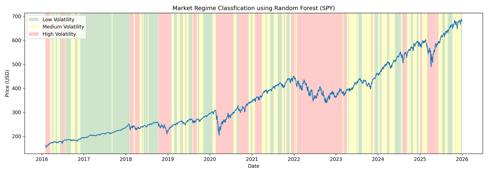

# Market Regime Classification Engine

## Overview

This project is a machine learning pipeline which takes in financial data from a specified period of time and yfinance library, it classifies the historical market data into distinct 'regimes' (Low/Medium/High volatility). By identifying these market states we can dynamically change the approach around the market as risk is changing.

The engine calculates statistical features of the data and uses a random forest classification to identify the shifts in market behaviour. https://scikit-learn.org/stable/modules/generated/sklearn.ensemble.RandomForestClassifier.html

## Libraries used

- yfinance
- pandas, numpy
- matplotlib
- scikit-learn
- streamlit

## How to run the project

1. Clone repository

```
git clone [https://github.com/leolin25/market-regime-classifier.git](https://github.com/leolin25/market-regime-classifier.git)
cd market-regime-classifier
```

2. Setup the virual environment (Windows)

```
python -m venv venv
venv\Scripts\activate
```

Mac/Linux:

```
source venv/bin/activate
```

3. Install dependencies

```
pip install -r requirements.txt
```

4. Lauch the Web Dashboard (Recommended)

```
streamlit run app.py
```

5. Run the terminal engine (Alternative)

```
python main.py
```

Using this method outputs the graph in output folder. If you want to change the ticker, start date, end date or window hyperparameter you can edit the bottom code of main.py
```
if __name__ == "__main__":
    TICKER = "SPY"
    START_DATE = "2016-01-01"
    END_DATE = "2025-12-31"
    WINDOW = 20
    
    df = load_data(TICKER, START_DATE, END_DATE)
    df = add_features(df, window=WINDOW)
    df = classification(df)

    plot_regimes(df, TICKER)
```

## Important Files

- data_exploration.ipynb:
Data visualisation and exploration done in this notebook. It justifies some of the steps.

- data_loader.py:
yfinance API connections

- features.py:
Log returns and rolling statistics calculations

- model.py:
Random forest model architecture

- visualise.py:
Produces the graphs using matplotlib

## Example

This is an example of regime classification done on SPY from 2016-2026. This is a graph produced in the data exploration notebook

